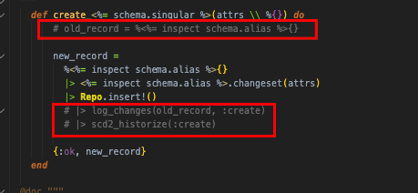

# phnx_project_template_custom_layer_for_historization
Modifying the default phoenix project with different Repo handling - adding default historization features and wrapping in a service layer

modifying the generators with following features:
	- modify table generation, with adding the deleted_at timestamp field to every table for soft deletes
	- modify get and get_all repo functions to exclude soft-deleted records
	- add field_log and history tables automatically for every table
	- within a transaction, handle the historization and the field change log as well for a given change for updates, inserts, and deletes as well
	- create a service layer, that hides the repo implementation details from the controllers, and instead of using repo in the changeset handling, the project should use the service layer, that handles every historization step within a transaction, with the above constraints.
	- I want my phnx.gen generators to use the service layer by default at every step.

## Prerequisites

- Infra setup for ecto -> since I use docker for Postgres, I create usually an _infra folder, where I put the docker commands to create the Postgres db, so usually I don't use mix ecto.create command.
- mix phx.new command executed to create the project default canvas

## Usage

### Custom Mix tasks for Generation

- I created a bash shell script to execute mix generator commands.
  - You may see this command script in the project root, which is outside the generated phx project's folder.
- In order to successfully generate entities with the additional features, you'll need following steps:

In the bash script:

1. execute mix phx.gen.[...] (I used html, so mix phx.gen.html for this, but I didn't override the html part in this template project)
2. execute custom mix task: gen_field_logs.ex - not necessarily so, but I execute it with the same entity fields, that were used in the phx.gen.html
3. execute custom mix task: gen_scd2.ex - here, it MUST be with the same fields than in the html generator

### Customized context

After generation, the {context}.ex file within lib/{project} folder, you have to uncomment everything:
	- this is due to the fact, that the items created are in the gen_field_logs.ex, and the gen_scd2.ex files, but the context is generated with the html

