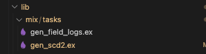
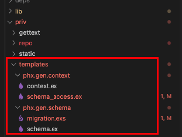
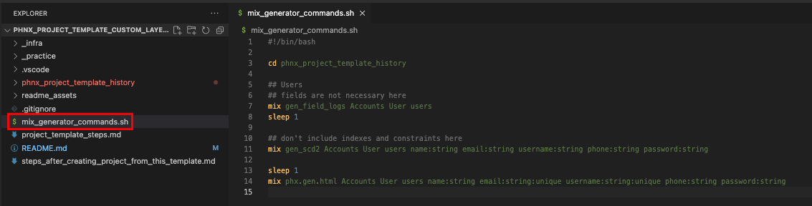
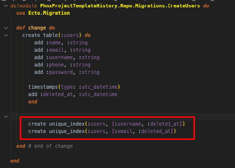

# phnx_project_template_custom_layer_for_historization
Modifying the default phoenix project with different Repo handling - adding default historization features and wrapping in a service layer

modifying the generators with following features:

	- modify table generation, with adding the deleted_at timestamp field to every table for soft deletes
	- generate field_log and history tables for every table
	- modify schema_access (in the context layer) generator in order to modify get and get_all repo functions to exclude soft-deleted records
	- modify schema_access (in the context layer) generator to generate code for field logging and scd2 logging.

## Prerequisites

- Infra setup for ecto -> since I use docker for Postgres, I create usually an _infra folder, where I put the docker commands to create the Postgres db, so usually I don't use mix ecto.create command.
- mix phx.new command executed to create the project default canvas
- copy the two custom mix tasks from the lib/mix/tasks folder:
  - 
- copy the {project}/priv/templates folder from this project into your {project}/priv folder:
  - 
- copy the bash command and modify it for your needs, based on the Usage section:
  - 

## Usage

### Custom Mix tasks for Generation

- I created a bash shell script to execute mix generator commands.
  - You may see this command script in the project root, which is outside the generated phx project's folder.
- In order to successfully generate entities with the additional features, you'll need following steps:

In the bash script:

1. execute custom mix task: gen_field_logs.ex - leave the field definitions for now, this table has a fix schema.
2. execute custom mix task: gen_scd2.ex - here, it MUST be with the same fields than in the html generator
3. execute mix phx.gen.[...] (I used html, so mix phx.gen.html for this, but I didn't override the html part in this template project, and you may use other generators for your purpose.
   1. This step will include also the context generation, which, if you use my template, will generate the necessary functions to use the field logging and the SCD2 logging.
4. always add 1 second sleep between the generator commands, since if migrations are generated with the same timestamp it get's you some headaches.
5. Always check if you have unique constraints defined, the Manual TODO section (below).

### Manual TODO for unique constraints!

One thing is to change, if you added unique constraints in your entity, you have to add the :deleted_at field to the migration file, BEFORE you run mix ecto.migrate, like so:

This is due to the fact, that if you don't add this, you delete a record (which will be a soft delete in this case, adding a date to the deleted_at field), if you don't add the :deleted_at to the unique index, anytime the user accidentally creates the same username or email (or whatever, but the user won't be able to see the deleted records), the user will recieve an error because of the unique constraint.

