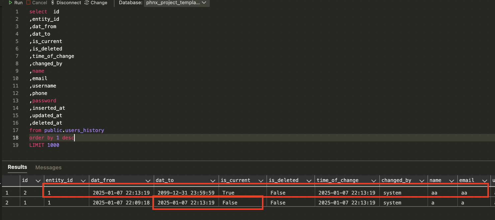

# phnx_project_template_custom_layer_for_historization
Modifying the default phoenix project with different Repo handling - adding default historization features and wrapping in a service layer

modifying the generators with following features:

	- modify table generation, with adding the deleted_at timestamp field to every table for soft deletes
	- generate field_log and history tables for every table
	- modify schema_access (in the context layer) generator in order to modify get and get_all repo functions to exclude soft-deleted records
	- modify schema_access (in the context layer) generator to generate code for field logging and scd2 logging.

## Prerequisites

- Infra setup for ecto -> since I use docker for Postgres, I create usually an _infra folder, where I put the docker commands to create the Postgres db, so usually I don't use mix ecto.create command.
- mix phx.new command executed to create the project default canvas
- copy the two custom mix tasks from the lib/mix/tasks folder:
  - 
- copy the {project}/priv/templates folder from this project into your {project}/priv folder:
  - 
- copy the bash command and modify it for your needs, based on the Usage section:
  - 

## Usage

### Custom Mix tasks for Generation

- I created a bash shell script to execute mix generator commands.
  - You may see this command script in the project root, which is outside the generated phx project's folder.
- In order to successfully generate entities with the additional features, you'll need following steps:

In the bash script:

1. execute custom mix task: gen_field_logs.ex - leave the field definitions for now, this table has a fix schema.
2. execute custom mix task: gen_scd2.ex - here, it MUST be with the same fields than in the html generator
3. execute mix phx.gen.[...] (I used html, so mix phx.gen.html for this, but I didn't override the html part in this template project, and you may use other generators for your purpose.
   1. This step will include also the context generation, which, if you use my template, will generate the necessary functions to use the field logging and the SCD2 logging.
4. always add 1 second sleep between the generator commands, since if migrations are generated with the same timestamp it get's you some headaches.
5. Always check if you have unique constraints defined, the Manual TODO section (below).

### Manual TODO for unique constraints!

One thing is to change, if you added unique constraints in your entity, you have to add the :deleted_at field to the migration file, BEFORE you run mix ecto.migrate, like so:


Add :deleted_at, and also nulls_distinct: false option to the unique index!

This is due to the fact, that if you don't add this, you delete a record (which will be a soft delete in this case, adding a date to the deleted_at field), if you don't add the :deleted_at to the unique index, anytime the user accidentally creates the same username or email (or whatever, but the user won't be able to see the deleted records), the user will recieve an error because of the unique constraint.

## Results

Take the example in the bash script, Accounts context, User schema with users table, with the following fields:

- name:string
- email:string:unique
- username:string:unique
- phone:string
- password:string

For these fields, following migrations will be generated:

### users table

```elixir
# the normal users table
defmodule PhnxProjectTemplateHistory.Repo.Migrations.CreateUsers do
  use Ecto.Migration

  def change do
    create table(:users) do
        add :name, :string
        add :email, :string
        add :username, :string
        add :phone, :string
        add :password, :string

      timestamps(type: :utc_datetime)
      add :deleted_at, :utc_datetime
      end

      ## :deleted_at and nulls_distinct:false are manually added!
      create unique_index(:users, [:username, :deleted_at], nulls_distinct: false) 
      create unique_index(:users, [:email, :deleted_at], nulls_distinct: false)

  end # end of change

end
```

### users_field_log table

```elixir
defmodule PhnxProjectTemplateHistory.Repo.Migrations.CreateUsersFieldLog do
  use Ecto.Migration

  def change do
    create table(:users_field_log) do
        add :row_id, :integer
        add :action, :string
        add :field_name, :string
        add :old_value, :string
        add :new_value, :string
        add :time_of_change, :utc_datetime
        add :changed_by, :string
  
      timestamps(type: :utc_datetime)
      add :deleted_at, :utc_datetime
      end

  
  end # end of change

end
```

Explanation:

- table will be generated with the name of the original table + "_field_log" suffix
- the fields of every field_log table is fix, it doesn't depend on the underlying table's schema
- row_id is the id of the record in the original users table
- action is create, update, or delete
- field_name is the field's name that changed (at :delete action, it is "N/A")
- old_value is the value that was the original value of the field that was changed. (at :create and :delete actions, this is "N/A")
- new_value is the new value in the field.
- time_of_change is the value when the field's value has been changed
- changed_by should be the modifier (currently this is fixed as "system" value)

### users_history table

```elixir
defmodule PhnxProjectTemplateHistory.Repo.Migrations.CreateUsersHistory do
  use Ecto.Migration

  def change do
    create table(:users_history) do
        add :entity_id, :integer
        add :dat_from, :utc_datetime
        add :dat_to, :utc_datetime
        add :is_current, :boolean, default: false, null: false
        add :is_deleted, :boolean, default: false, null: false
        add :time_of_change, :utc_datetime
        add :changed_by, :string
        add :name, :string
        add :email, :string
        add :username, :string
        add :phone, :string
        add :password, :string
  
      timestamps(type: :utc_datetime)
      add :deleted_at, :utc_datetime
      end

  
  end # end of change

end
```

Explanation:

- History table will have some fix additional fields added to the original table's fields. These are:
  - entity_id -> the id of the original record
  - dat_from -> this is the datetime of when the record was actual
  - dat_to -> this is the end of the validity of the historical record. For an actual record the dat_to points to a reasonably far time in the future, like 2099.12.31
  - is_current and is_deleted are boolean flags. 


## Data examples

### Add user

Let's add a new user on the UI:


Let's track down what happened in the tables:

1. users table shows the data as expected:
   


2. users_field_log table shows every field with a create action, an "N/A" old value, and the added values in the new_value field:


3. users_history table is a standard SCD2 table. Currently it should contain the same record as in the users table, with an is_current = true, and an is_deleted = false flag.


### Change a user

Let's change 3 fields for a user on the UI:


Let's track down what happened in the database:

1. users table shows the data as expected:


2. users_filed_log table should only show changed records for the fields that have changed:


3. users_history table should update the former record as is_current = false, and dat_to to the value of the current change, and add an additional record with the currently valid data:



### Delete a user

Now delete the user on the UI, and check what happens in the db:

UI:


1. users table should now update the deleted_at field with the timestamp of the deletion (this is "soft-delete"):


2. users_field_log will contain only one record with the fact that the record with the id has been deleted:


3. users_history will now update the current record as is_current = false, is_deleted = true, and update the dat_to value to the time of deletion:


